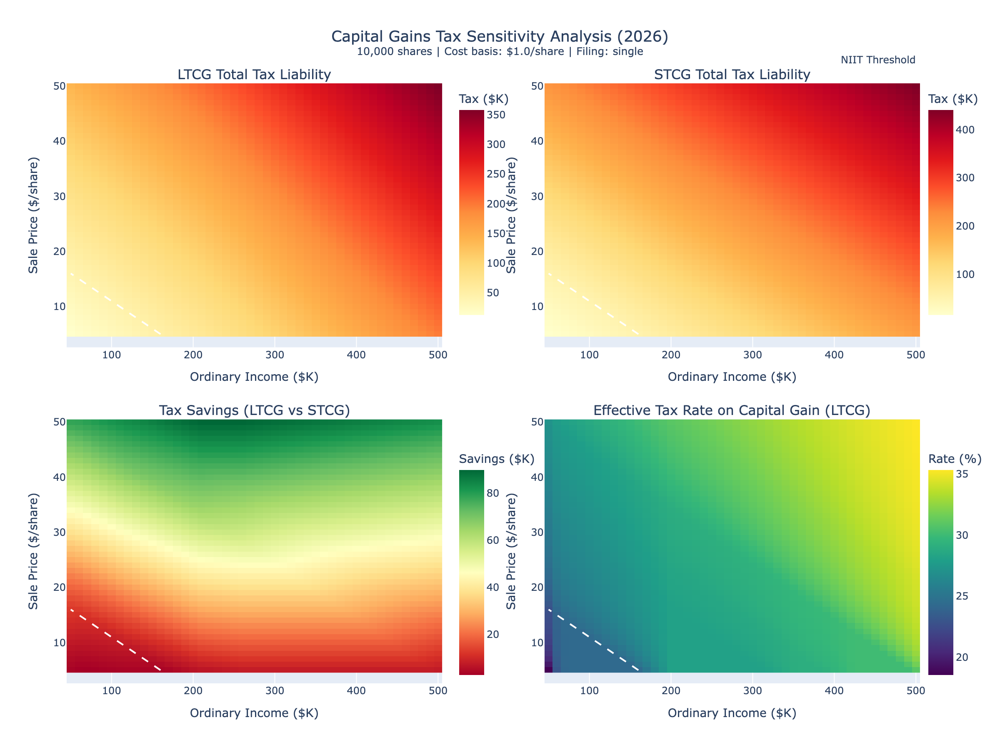

# Capital Gains Tax Sensitivity Analysis

A two-parameter sensitivity analysis tool for understanding tax implications of selling equity shares as a US California resident.



## Overview

This tool generates interactive heatmaps showing total tax liability across different combinations of:
- **Ordinary income** (W-2 wages, independent of stock sale)
- **Sale price per share**

It compares Long-Term Capital Gains (LTCG) vs Short-Term Capital Gains (STCG) scenarios and calculates:
- Federal capital gains tax (0%/15%/20% for LTCG, ordinary rates for STCG)
- California state tax (1-13.3%, treats all gains as ordinary income)
- Net Investment Income Tax (NIIT) - 3.8% above MAGI thresholds
- Total tax liability and effective rates

## Quick Start

### 1. Install Dependencies

```bash
pip install -r requirements.txt
```

### 2. Create Your Configuration

```bash
cp config.example.json config.json
```

### 3. Edit config.json with Your Parameters

Open `config.json` and customize:
- Your cost basis (exercise price per share)
- Number of shares
- Filing status
- Income and price ranges to analyze
- Representative scenarios for detailed breakdown

### 4. Run the Analysis

```bash
python capital_gains_tax_analysis.py
```

Or specify a custom config file:

```bash
python capital_gains_tax_analysis.py /path/to/my-config.json
```

## Configuration

### config.json Structure

```json
{
  "cost_basis_per_share": 1.00,      // Your exercise price per share
  "num_shares": 10000,                // Number of shares to model
  "filing_status": "single",          // "single" or "married"
  "tax_year": 2026,

  "income_range": {
    "min": 50000,                     // Minimum ordinary income to model
    "max": 500000,                    // Maximum ordinary income to model
    "steps": 46                       // Grid resolution (higher = more detail)
  },

  "price_range": {
    "min": 5,                         // Minimum sale price per share
    "max": 50,                        // Maximum sale price per share
    "steps": 46                       // Grid resolution
  },

  "representative_scenarios": [        // Specific scenarios for detailed table
    {"income": 150000, "price": 20},
    {"income": 250000, "price": 30},
    {"income": 400000, "price": 40}
  ]
}
```

### Privacy Note

`config.json` is gitignored and will not be committed to version control. This keeps your personal financial details private. Only `config.example.json` (with placeholder values) is tracked.

## Output Files

| File | Description | Tracked in Git? |
|------|-------------|-----------------|
| `tax_analysis_dashboard.html` | Full interactive report | No |
| `tax_heatmaps.html` | Standalone interactive Plotly heatmaps | No |
| `tax_heatmaps.png` | Static PNG for presentations | No |
| `representative_scenarios.csv` | Detailed scenario data | No |

All output files are gitignored since they may reveal personal financial scenarios.

## Dashboard Features

The interactive HTML dashboard includes:

1. **LTCG Total Tax Liability** - Heatmap showing total tax (federal + CA + NIIT) for long-term gains
2. **STCG Total Tax Liability** - Heatmap showing total tax for short-term gains
3. **Tax Savings Map** - Difference between STCG and LTCG (green = more savings from holding long-term)
4. **Effective Tax Rate** - Marginal rate on the capital gain itself

### Interactive Features

- **Unified Tooltip**: Hover over any heatmap to see complete tax breakdown for both LTCG and STCG scenarios, including Federal, CA State, and NIIT components
- **Synchronized Crosshairs**: Crosshair lines appear on all four plots simultaneously when hovering
- **Drag-to-Zoom**: Click and drag to zoom into any region; double-click to reset

### Visual Indicators

- **White dashed line**: Shows where NIIT (3.8%) begins to apply (MAGI > $200K single / $250K married)
- **Color gradients**: Warmer colors = higher tax liability

## Tax Calculations

### Federal Long-Term Capital Gains (LTCG)
- **0%** on gains up to ~$47,025 taxable income (single)
- **15%** on gains up to ~$518,900 taxable income
- **20%** on gains above that threshold

### Federal Short-Term Capital Gains (STCG)
Taxed as ordinary income at marginal rates (10-37%)

### California State Tax
California does **not** offer preferential rates for capital gains. All gains are taxed as ordinary income at rates from 1% to 13.3%.

### Net Investment Income Tax (NIIT)
3.8% additional tax on investment income when Modified AGI exceeds:
- $200,000 (single)
- $250,000 (married filing jointly)

### Not Modeled
- **Alternative Minimum Tax (AMT)**: May apply, especially with ISO exercises
- **Medicare surtax on wages**: 0.9% above $200K/$250K thresholds
- **State credits/deductions**: Various CA-specific provisions

## Example Scenarios

With default example config (10,000 shares, $1.00 cost basis, single filer):

| Scenario | Capital Gain | LTCG Tax | STCG Tax | Tax Savings |
|----------|--------------|----------|----------|-------------|
| $150K income, $20/share | $190,000 | $87,037 | $117,219 | $30,182 |
| $250K income, $30/share | $290,000 | $157,097 | $214,531 | $57,433 |
| $400K income, $40/share | $390,000 | $269,749 | $338,257 | $68,508 |

*Note: Actual numbers depend on your specific cost basis, share count, and filing status.*

## Customization Ideas

After running the base analysis, consider extending:

- Add contour lines for specific tax bracket thresholds
- Model scenarios with both ISO and NSO sales in same year
- Add marginal rate visualization
- Model quarterly estimated tax payment requirements
- Add AMT calculation for ISO exercises

## Disclaimer

This tool is for **educational and planning purposes only**. Tax laws are complex and subject to change. The 2026 tax brackets used are estimates based on inflation adjustments.

**Always consult a qualified tax professional before making financial decisions.**

THE SOFTWARE IS PROVIDED "AS IS", WITHOUT WARRANTY OF ANY KIND, EXPRESS OR IMPLIED, INCLUDING BUT NOT LIMITED TO THE WARRANTIES OF MERCHANTABILITY, FITNESS FOR A PARTICULAR PURPOSE AND NONINFRINGEMENT. IN NO EVENT SHALL THE AUTHORS BE LIABLE FOR ANY CLAIM, DAMAGES OR OTHER LIABILITY, WHETHER IN AN ACTION OF CONTRACT, TORT OR OTHERWISE, ARISING FROM, OUT OF OR IN CONNECTION WITH THE SOFTWARE OR THE USE OR OTHER DEALINGS IN THE SOFTWARE.

## Example Data Notice

The values in `config.example.json` and the example screenshots are **placeholder representations only**, using round numbers for illustration purposes. They do not represent any actual person's financial situation, compensation, or equity holdings.

## License

MIT License - Use freely for personal tax planning.
